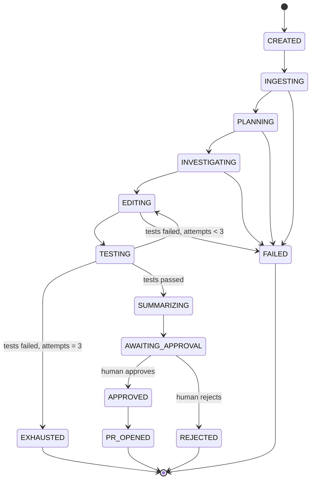

# DevMind — Solution Design

> Autonomous long-horizon coding agent. Takes a GitHub issue on a repository and works it
> end-to-end — plan, investigate, patch, test, self-correct — then **stops** and waits for a
> human before anything leaves the machine.

| | |
|---|---|
| **Status** | Approved for build |
| **Owner** | rudrashettyrajkumar@gmail.com |
| **Version** | 1.0 |
| **Last updated** | 2026-08-28 |
| **Engineering standards** | `Claude.md` (authoritative for all code in this repo) |

---

## 1. Problem statement

Give a maintainer a way to hand off a well-scoped bug or small feature to an agent and get
back a **reviewed-ready draft PR**, with a full audit trail of how the agent got there — and
with a hard guarantee that nothing is pushed, merged, or published without an explicit human
decision.

The hard part is not "call an LLM with tools." It is everything around that:

1. **Long horizon.** A real fix takes dozens of tool calls across many minutes. Context
   overflows, the agent forgets its plan, and cost drifts. This needs an explicit plan
   artifact, context budgeting, and step budgets.
2. **Verification.** The agent's own claim that it fixed the bug is worthless. The test suite
   is the oracle, and it must run somewhere the agent cannot damage.
3. **Recovery.** Tests fail on the first attempt most of the time. The system must read the
   failure, form a hypothesis, and try again — with a bounded budget and a way to detect that
   it is going in circles.
4. **Containment.** An agent with `git push` and a network is a supply-chain incident waiting
   for a bad day. The approval gate has to be structural, not a prompt instruction.

## 2. Scope

### In scope
- Ingest `{repo_url, issue_number}` (or a free-text issue description).
- Shallow-clone at a pinned commit into an isolated workspace.
- Plan → investigate → edit → test → self-correct (≤ 3 fix attempts).
- Run the repo's own test suite in a sandbox.
- Produce a change summary + unified diff.
- Block on human approval; on approve, open a **draft** PR; on reject, halt and record why.
- Full event log, resumable sessions, token/cost accounting, REST + SSE API.

### Out of scope (v1 — deliberately)
| Not building | Why |
|---|---|
| Multi-agent / manager-worker swarm | One loop with a good plan artifact beats orchestration overhead at this scope. Revisit only if measured. |
| Vector / embedding code index | `ripgrep` + a file tree + an AST symbol map answers "where is X" on repos of the target size. A vector store is infrastructure with no current requirement. |
| Auto-merge, force-push, branch deletion, review-comment replies | Explicitly forbidden by the safety model. |
| Multi-language build matrix | v1 targets Python repos (pytest). The `Sandbox` and test-parser seams are where language #2 plugs in. |
| Web UI | REST + SSE + a thin CLI client. A UI adds no architectural insight. |
| Distributed queue / worker fleet | One process runs sessions in an asyncio task group. No current scale requirement (YAGNI). |

## 3. Non-negotiable safety invariants

These are architectural, enforced by structure and asserted by tests — not by asking the model nicely.

| # | Invariant | How it is enforced |
|---|---|---|
| **SI-1** | The agent can never push, open a PR, merge, or contact a remote. | Push/PR code lives in `PRService`, which is **not registered in the tool registry**. The agent literally has no tool that reaches the network. |
| **SI-2** | Remote git operations are impossible from inside the agent's execution context. | Sandbox runs with networking disabled (Docker `--network=none`; subprocess backend scrubs git remote creds and sets `GIT_TERMINAL_PROMPT=0`, `GIT_ASKPASS=/bin/false`). |
| **SI-3** | `PRService.open_draft_pr()` refuses unless a persisted `ApprovalRecord` exists for that session with `decision == APPROVED`. | Guard clause + repository lookup at the top of the method; unit-tested for the negative case. |
| **SI-4** | Approval is single-use and session-bound. | `ApprovalRecord` carries an opaque token, a session FK, and a `consumed_at` timestamp. Replay raises `ApprovalAlreadyConsumedError`. |
| **SI-5** | All file writes stay inside the session workspace. | `WorkspacePathGuard.resolve()` — `Path.resolve()` then `is_relative_to(workspace_root)`; symlink escape and `../` both rejected. Every write/read tool goes through it. |
| **SI-6** | PRs are always opened as **drafts**, never merged. | `gh pr create --draft`; no merge code path exists in the codebase. |
| **SI-7** | Every LLM call, tool call, and state transition is persisted before it takes effect. | `EventRepository.append()` is called by the orchestrator, not by the agent. Sessions are replayable from the event log. |
| **SI-8** | Shell execution is bounded and allowlisted. | `run_command` rejects any binary outside `ALLOWED_COMMAND_BINARIES`; every command has a hard timeout and output truncation. |

> **Design rule:** if a safety property can be expressed as "the capability does not exist in
> this object graph," express it that way. Prompt-level rules are a second layer, never the
> first.

## 4. Architecture

### 4.1 Layer map

```
┌───────────────────────────────────────────────────────────────────────┐
│ api/            FastAPI routers — HTTP only. No business logic.       │
│                 sessions · approvals · events(SSE) · health           │
├───────────────────────────────────────────────────────────────────────┤
│ services/       Use-case orchestration                                │
│   SessionOrchestrator ── drives the state machine                     │
│   AgentLoop ──────────── ReAct loop, context budget, step budget      │
│   PlannerService ─────── issue → todo plan                            │
│   SelfCorrectionController ── failure → retry decision                │
│   TestExecutionService ─ run suite, parse failures                    │
│   ApprovalService ────── gate, tokens, halt-on-reject                 │
│   PRService ──────────── branch/commit/push/draft-PR  (POST-APPROVAL) │
│   RepoIngestionService · WorkspaceManager · AnthropicProvider         │
├───────────────────────────────────────────────────────────────────────┤
│ tools/          Agent-facing capabilities (Tool ABC + registry)       │
│                 read_file · list_dir · search_code · write_file       │
│                 apply_patch · todo_write · run_tests · run_command    │
│                 git_diff · finish        ← NO network, NO push        │
├───────────────────────────────────────────────────────────────────────┤
│ repositories/   All SQLAlchemy lives here. Nothing above imports      │
│                 Session (the SQLAlchemy one).                         │
├───────────────────────────────────────────────────────────────────────┤
│ models/         ORM  ·  schemas/  Pydantic DTOs  ·  interfaces/  ABCs │
│ core/           config · constants · enums · logging                  │
│ prompts/        *.md with YAML frontmatter + PromptLoader             │
│ exceptions/     DevMindError hierarchy                                │
└───────────────────────────────────────────────────────────────────────┘
             ↓ adapters
   Sandbox (ABC) ── DockerSandbox | SubprocessSandbox
   LLMProvider (ABC) ── AnthropicProvider | (FakeLLMProvider in tests)
   GitHubClient (concrete — `gh` CLI wrapper)
```

**Dependency rule:** each layer talks only to the layer directly below, through the
abstraction it owns. `api/` never sees an ORM model; `services/` never builds a `Response`;
`repositories/` never contains business rules.

### 4.2 Where abstractions are and are not used

Per `Claude.md` §4 and §9, an ABC has to earn its keep. The decisions, stated once so no one
re-litigates them mid-build:

| Component | ABC? | Justification |
|---|---|---|
| `LLMProvider` | **Yes** | Real second implementation (`FakeLLMProvider`) drives every deterministic test in the suite. Provider swap is a live possibility. |
| `Sandbox` | **Yes** | Two real implementations shipping in v1: `DockerSandbox` (preferred) and `SubprocessSandbox` (dev machines without Docker — including the primary dev box here). |
| `Tool` | **Yes** | Ten+ implementations, a registry that iterates them, and a uniform JSON-schema contract. Textbook polymorphism. |
| `GitHubClient` | **No** | One implementation, no second in sight. Mocked directly in tests. An ABC here would be ceremony. |
| `TestOutputParser` | **Yes, but only when #2 lands** | v1 ships `PytestOutputParser` as a plain class behind a narrow method on `TestExecutionService`. The ABC gets extracted the day a JS parser is needed — not before. |
| Repository per aggregate | **Yes** (Session, Event, Approval) | Real testing boundary; all three are queried from services that must stay DB-free. |

### 4.3 Runtime topology

Single FastAPI process. `POST /sessions` persists the session and schedules
`SessionOrchestrator.run()` as a background asyncio task. The HTTP request returns
immediately with a session id; progress is consumed over SSE. Sandbox work runs in a
thread executor so blocking subprocess/Docker calls never stall the event loop.

No queue, no worker fleet — one process, bounded concurrency via
`MAX_CONCURRENT_SESSIONS`. That is the actual requirement.

## 5. Session lifecycle



`SessionStatus` is a `StrEnum` with `is_terminal()` and `can_transition_to()`. Illegal
transitions raise `InvalidStateTransitionError` — the state machine is the single source of
truth for what the orchestrator is allowed to do next, and it is unit-tested exhaustively.

`AWAITING_APPROVAL` is a **durable** state. The process can restart; the session waits.

## 6. The agent loop

A hand-written loop rather than the SDK's `tool_runner`. Justification: this loop must
persist an event per step, enforce a step budget, checkpoint state for resumability, swap
system prompts per phase, and compact its own context. That is control the runner does not
expose, and the runner is beta. (Recorded here so it is a decision, not an accident.)

```python
# services/agent_loop.py — shape only; see spec for the full contract
class AgentLoop:
    def __init__(self, llm: LLMProvider, tools: ToolRegistry,
                 events: EventRepository, prompts: PromptLoader) -> None: ...

    async def run(self, ctx: AgentContext, phase: AgentPhase) -> LoopOutcome:
        for step in range(ctx.remaining_steps):
            await self._compact_if_needed(ctx)
            reply = await self._llm.complete(ctx.to_request(phase))
            await self._events.append(ctx.session_id, EventType.LLM_CALL, ...)
            if reply.stop_reason is StopReason.END_TURN:
                return LoopOutcome.completed(reply)
            results = await self._execute_tool_calls(ctx, reply.tool_calls)
            ctx.extend(reply, results)      # ALL results in one user message
        return LoopOutcome.step_budget_exhausted()
```

**Loop invariants**
- Parallel `tool_use` blocks are executed then returned as **one** user message containing all
  `tool_result` blocks. Splitting them teaches the model to stop batching.
- A failing tool returns `tool_result` with `is_error=True` and a readable message. It is never
  dropped, and it never raises out of the loop — a tool error is information, not a crash.
- Every step increments a counter checked against `MAX_AGENT_STEPS_PER_PHASE`.
- Tool inputs are always parsed with `json.loads`, never string-matched.

### 6.1 Context management

Long-horizon means context is the binding constraint. Four layers, cheapest first:

1. **Prompt caching.** Static prefix — tool definitions, then the system prompt, then the
   repo-structure brief — carries `cache_control: {"type": "ephemeral"}`. Volatile content
   (step counter, timestamps) is kept strictly *after* the last breakpoint, because any byte
   change in the prefix invalidates everything after it. Render order is `tools` → `system` →
   `messages`; ≤ 4 breakpoints. `usage.cache_read_input_tokens` is logged every call and a
   sustained zero is treated as a bug.
2. **Tool-result budgeting.** Every tool result is truncated to `MAX_TOOL_RESULT_CHARS` with a
   `[truncated N of M chars]` marker; file reads are line-ranged; search results are capped.
3. **Server-side context editing.** `context_management.edits = [{"type":
   "clear_tool_uses_20250919"}]` (beta `context-management-2025-06-27`) clears stale tool
   results once the transcript passes a threshold. This is *clearing*, not summarizing.
4. **Rolling plan re-anchor.** Before each phase, the current todo list and the accepted diff
   are re-injected as a compact brief, so the agent's goal survives any context surgery.

Model defaults: `claude-opus-5`, adaptive thinking (`{"type": "adaptive"}`),
`output_config.effort = "high"` for the loop and `"low"` for cheap classification calls. No
`budget_tokens` — removed on this model family. Streaming for any long call.

### 6.2 Tool surface

Bash-with-everything is fast to build and terrible to constrain; a dedicated tool per
capability gives typed inputs, a natural allowlist, and clean audit events. We take the
dedicated-tool route and keep one narrow, allowlisted `run_command` escape hatch.

| Tool | Input | Notes |
|---|---|---|
| `list_dir` | path, depth | Respects `.gitignore`. |
| `read_file` | path, start_line?, end_line? | Line-ranged; truncation marked. |
| `search_code` | pattern, glob?, max_results | `ripgrep`; falls back to `grep -rn`. |
| `find_symbol` | name | Python AST index; regex fallback for other languages. |
| `write_file` | path, content | Full-file write, path-guarded. |
| `apply_patch` | path, old, new | Exact-match replace; fails loudly on ambiguity. |
| `todo_write` | items[] | The plan artifact. Persisted, versioned, re-injected. |
| `run_tests` | node_ids?, keyword? | Sandboxed pytest. Returns a structured `TestRunReport`. |
| `run_command` | argv[] | Allowlist + timeout + no network. |
| `git_diff` | — | Working-tree diff, capped. |
| `finish` | summary, confidence | Explicit exit; ends the phase deliberately. |

Each tool is a `Tool` subclass declaring a Pydantic input model; the JSON schema handed to the
API is generated from it (`model_json_schema()`), with `strict: true` and
`additionalProperties: false`. One definition, no drift between validation and schema.

## 7. Sandbox

```python
class Sandbox(ABC):
    @abstractmethod
    async def run(self, cmd: SandboxCommand) -> CommandResult: ...
    @abstractmethod
    async def setup(self, workspace: Path) -> None: ...
    @abstractmethod
    async def teardown(self) -> None: ...
```

| | `DockerSandbox` (preferred) | `SubprocessSandbox` (fallback) |
|---|---|---|
| Isolation | Container, `--network=none`, read-only bind of the repo except the work dir, cpu/mem caps, non-root user | Same-host process, cwd-pinned, scrubbed env, no network creds, `setsid` process group |
| Selected when | Docker daemon reachable | `SANDBOX_BACKEND=subprocess` or Docker probe fails |
| Honest limitation | — | **Not a security boundary.** Documented in the README and logged as a warning at startup. Correct choice for a trusted dev box; wrong choice for untrusted repos. |

Both enforce: hard timeout (`SANDBOX_COMMAND_TIMEOUT_SECONDS`), stdout/stderr capture with
truncation, kill of the whole process group on timeout, and a `CommandResult` DTO
(`exit_code`, `stdout`, `stderr`, `duration_seconds`, `timed_out`).

Backend selection is a startup decision made by `SandboxFactory`, logged once, and recorded on
the session record — so any run's isolation level is visible after the fact.

## 8. Self-correction loop

The system's most interesting behaviour, and the one most likely to burn money if unbounded.

```
run_tests ──► pass ──────────────────────────────────► SUMMARIZING
     │
     └─ fail ─► PytestOutputParser ─► TestFailureReport
                                            │
                                  SelfCorrectionController
                                            │
              ┌─────────────────────────────┼──────────────────────────┐
              ▼                             ▼                          ▼
     attempts == MAX (3)          same failure signature       new signature
              │                     twice in a row                     │
              ▼                             ▼                          ▼
         EXHAUSTED                  EXHAUSTED (no-progress)     EDITING (retry)
```

`TestFailureReport` is a Pydantic model — not a wall of text:

```python
class TestFailureReport(BaseModel):
    total: int
    passed: int
    failed: int
    errors: int
    failures: list[TestFailure]        # node_id, message, assertion, trimmed traceback, file, line
    signature: str                     # stable hash of sorted node_ids + exception types
    truncated_output: str              # tail, bounded by MAX_TEST_OUTPUT_CHARS
```

`signature` is what makes no-progress detection possible: identical signature on consecutive
attempts means the last edit changed nothing that mattered, and burning attempt 3 on the same
hypothesis is waste. Escalate immediately instead.

The retry prompt (`prompts/test_failure_analysis.md`) is deliberately narrow: here is the
failure report, here is your last diff, here is your plan — state the root cause, then fix it.
It does **not** re-dump the whole investigation.

A pre-flight baseline run happens *before* any edit. Tests already red on `HEAD` are recorded
as pre-existing and excluded from the pass/fail verdict, so the agent is never blamed for a
broken `main` — and never claims credit for it either.

## 9. Human approval gate

The centrepiece. Three independent layers:

**Layer 1 — capability separation (primary).** The tool registry has no push/PR tool. The
agent cannot do the dangerous thing because the dangerous thing is not in its object graph.

**Layer 2 — state machine.** `PR_OPENED` is reachable only from `APPROVED`, and `APPROVED` only
from `AWAITING_APPROVAL` via `ApprovalService.decide()`. Any other path raises.

**Layer 3 — guard clause + audit.** `PRService.open_draft_pr()` re-reads the `ApprovalRecord`
from the database and refuses on anything other than `APPROVED` + unconsumed. The check is not
trusted from the caller.

**The handoff payload** (`ApprovalRequest`) is what a human actually needs to decide:

- the issue, restated as the agent understood it;
- the final todo plan with per-item status;
- change summary — what changed, in which files, and why;
- the full unified diff, plus per-file added/removed counts;
- the test evidence: baseline result, final result, and every failed attempt in between;
- attempts used, steps used, wall time, tokens, and **estimated cost in dollars**;
- explicit risk notes the agent is required to produce (what it was unsure about).

Rejection is a first-class outcome: `POST /sessions/{id}/approval {decision: "rejected",
reason: "..."}` → status `REJECTED`, reason persisted, workspace retained for inspection,
`SESSION_REJECTED` event emitted. Nothing is pushed, and no retry is attempted — a human said
no, and the system's job is to stop.

## 10. GitHub integration

Everything through the authenticated `gh` CLI — it already solves auth, and shelling to it is
honest about the trust boundary. Two phases, deliberately split:

- **Read (pre-approval):** `gh issue view --json` for title/body/labels; `git clone --depth`
  at a pinned SHA. Read-only, runs before the gate.
- **Write (post-approval only):** create branch `devmind/issue-{n}-{slug}`, commit with a
  conventional-commit subject and a body referencing the issue, push, then
  `gh pr create --draft --base <default> --head <branch>`.

The PR body is generated from `prompts/pr_body.md` and always includes: what changed, why,
test evidence, attempts used, and a standing footer stating the change was produced by an
autonomous agent and approved by a named human. Reviewers must never have to guess a PR's
provenance.

If the push or PR creation fails, the session moves to `FAILED` with the branch left intact —
never silently retried against a remote.

## 11. Data model

```
sessions
  id (uuid, pk) · repo_url · issue_number · issue_title · issue_body
  base_commit_sha · workspace_path · branch_name · status(enum)
  sandbox_backend(enum) · fix_attempts · total_steps
  input_tokens · output_tokens · cache_read_tokens · estimated_cost_usd
  created_at · updated_at · completed_at · failure_reason

events                          (append-only; the audit trail)
  id · session_id fk · sequence(int) · event_type(enum) · payload(json)
  created_at            unique(session_id, sequence)

todo_items
  id · session_id fk · position · content · status(enum) · created_at · updated_at

test_runs
  id · session_id fk · attempt · is_baseline · exit_code · passed · failed
  errors · signature · report(json) · duration_seconds · created_at

approvals
  id · session_id fk · token(unique) · decision(enum) · reason
  decided_by · decided_at · consumed_at · created_at

pull_requests
  id · session_id fk · number · url · branch · head_sha · created_at
```

`events` is append-only with a per-session monotonic `sequence`, which is what makes SSE
resumption (`Last-Event-ID`) and post-hoc replay work.

## 12. API surface

| Method | Path | Purpose |
|---|---|---|
| `POST` | `/api/v1/sessions` | Start a run. Returns `202` + `SessionRead`. |
| `GET` | `/api/v1/sessions` | List, filter by status. |
| `GET` | `/api/v1/sessions/{id}` | Full session state. |
| `GET` | `/api/v1/sessions/{id}/events` | Paginated event history. |
| `GET` | `/api/v1/sessions/{id}/stream` | SSE live feed, resumable via `Last-Event-ID`. |
| `GET` | `/api/v1/sessions/{id}/approval-request` | The human-review payload (§9). |
| `POST` | `/api/v1/sessions/{id}/approval` | `{decision, reason?, decided_by}` — the gate. |
| `GET` | `/api/v1/sessions/{id}/diff` | Unified diff, `text/plain`. |
| `POST` | `/api/v1/sessions/{id}/cancel` | Cooperative cancel → `HALTED`. |
| `GET` | `/health` | Liveness + sandbox backend + provider reachability. |

Errors are RFC-7807-shaped, mapped from the `DevMindError` hierarchy by a single exception
handler. No `HTTPException` raised from a service, ever.

## 13. Prompt system

One `.md` file per prompt in `src/devmind/prompts/`, YAML frontmatter for metadata, markdown
body for the text. Zero prompt text in Python string literals.

```markdown
---
name: test_failure_analysis
version: 1.0
model: claude-opus-5
effort: high
description: Diagnose a failing test run and produce the next fix hypothesis
variables: [failure_report, current_diff, todo_plan, attempt_number, max_attempts]
---
```

`PromptLoader` loads, caches, validates declared `variables` against what is passed, and
renders. A missing or extra variable is a startup-time error, not a mystery at runtime.

Prompt inventory: `system_agent`, `planner`, `investigation`, `patch_author`,
`test_failure_analysis`, `change_summary`, `pr_body`.

## 14. Configuration

`pydantic-settings`, one `Settings` object, `.env.example` committed. No stray
`os.environ.get()` anywhere in the codebase. Notable settings: `anthropic_api_key`,
`github_token`, `database_url`, `agent_model`, `sandbox_backend`, `max_fix_attempts` (3),
`max_agent_steps_per_phase`, `sandbox_command_timeout_seconds`, `max_session_cost_usd`,
`workspace_root`, `max_concurrent_sessions`.

`core/constants.py` holds every literal used more than once, marked `Final`. Business logic
references `MAX_FIX_ATTEMPTS`, never a bare `3`.

## 15. Observability & cost control

- **Structured JSON logs** with `session_id` bound via a `contextvars` filter — every line from
  a run is greppable by session.
- **Event log as the source of truth.** `SESSION_CREATED`, `STATE_CHANGED`, `PLAN_UPDATED`,
  `LLM_CALL`, `TOOL_CALL`, `TOOL_RESULT`, `TEST_RUN`, `FIX_ATTEMPT`, `APPROVAL_REQUESTED`,
  `APPROVAL_DECIDED`, `PR_OPENED`, `SESSION_FAILED`.
- **Cost accounting.** Every response's `usage` is recorded; cost is computed from a
  `MODEL_PRICING` table (per 1M tokens: `claude-opus-5` $5 in / $25 out; `claude-sonnet-5`
  $2 / $10; `claude-haiku-4-5` $1 / $5) with cache reads billed at the discounted rate.
  Crossing `MAX_SESSION_COST_USD` halts the session — a runaway loop is a budget bug, and the
  budget is enforced in code.

## 16. Failure modes considered

| Failure | Mitigation |
|---|---|
| Agent loops on the same failing hypothesis | Failure-signature no-progress detection (§8). |
| Context overflow mid-session | Caching + truncation + server-side context editing + plan re-anchor (§6.1). |
| Agent edits outside the workspace | `WorkspacePathGuard` on every path-taking tool (SI-5). |
| Test command hangs | Hard timeout + process-group kill (§7). |
| Repo has no tests | Detected during ingestion; session proceeds but the approval payload is flagged **UNVERIFIED — no test suite found**, prominently. |
| Tests already failing on `HEAD` | Baseline run; pre-existing failures excluded from the verdict (§8). |
| Cost runaway | Per-session USD ceiling (§15). |
| Process restart mid-session | Event log + persisted state; `AWAITING_APPROVAL` is durable. In-flight runs resume from the last checkpoint or fail cleanly — never half-applied. |
| Model returns malformed tool input | `strict: true` schemas + Pydantic validation → `is_error` tool result the agent can read and correct. |
| `gh` not authenticated | Startup health check; `POST /sessions` rejects early with a clear message rather than failing after ten minutes of work. |

## 17. Tech stack

| Concern | Choice | Why |
|---|---|---|
| Language | Python 3.12 | `StrEnum`, `X \| None`, modern typing. |
| API | FastAPI + Uvicorn | Async, Pydantic-native, SSE-friendly. |
| Validation | Pydantic v2 + pydantic-settings | Mandated by `Claude.md` §2. |
| ORM | SQLAlchemy 2.0 (`DeclarativeBase`, `Mapped[...]`) | Mandated by §3. |
| DB | SQLite (dev) → Postgres (prod) via URL | Single-process workload; no reason for more. |
| LLM | `anthropic` SDK, `claude-opus-5` | Adaptive thinking, 1M context, tool use, context editing. |
| Sandbox | Docker SDK / `subprocess` | Two backends, §7. |
| Prompts | `python-frontmatter` + PyYAML | §13. |
| Tests | pytest, pytest-asyncio, coverage | §12 of the epic plan. |
| Quality | ruff (lint+format), mypy `--strict` | CI gates. |
| Packaging | `uv` + `pyproject.toml`, src layout | §1. |

## 18. Delivery plan

Twelve epics, sequenced so every one is independently testable and the safety-critical work
(E9) lands before the only epic that can touch a remote (E10).

```
E1 Foundation ─► E2 Domain/Persistence ─► E3 LLM+Prompts ─┐
                                                          ├─► E6 Tools ─► E7 Agent Loop ─► E8 Self-Correction ─► E9 Approval Gate ─► E10 PR Delivery ─► E11 API/UX ─► E12 Hardening
E4 Workspace/Ingestion ─► E5 Sandbox ──────────────────────┘
```

Full breakdown in `docs/02-epic-breakdown.md`; per-epic implementation specs in
`docs/specs/`; ready-to-run build prompts in `docs/03-build-prompts.md`.

## 19. Definition of done

DevMind is done when, on a real public Python repository with a real open issue, it:
plans, investigates, patches, runs the suite, recovers from at least one genuine test failure,
stops at the gate with a reviewable summary and diff, and — only after a human clicks approve —
opens a draft PR. With `mypy --strict` and `ruff` clean, ≥ 85% coverage on services and tools,
and a test that proves the agent cannot push without approval.
